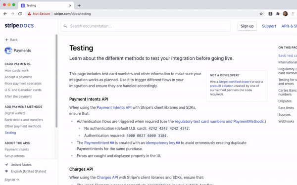

# Ctrl-Shift-F: Semantic Search for the Browser

[](https://opensource.org/licenses/Apache-2.0)

Search the information available on a webpage using
natural language instead of an exact string match. Uses
[https://arxiv.org/abs/2004.02984](MobileBERT)
fine-tuned on
[https://rajpurkar.github.io/SQuAD-explorer/](SQuAD)
via [TensorFlowJS](https://www.tensorflow.org/js) to
search for and return relevant answers in text.



_This extension is an experiment._ Deep learning models like BERT are powerful
but may return unpredictable and/or biased results that are tough to interpret.
Please apply best judgement when analyzing search results.

### Why?

Traditional search uses string-matching to find information within a webpage.
Although most of us have trained ourselves to search for what we're looking for
via string match, this can sometimes be a proxy for the true information we're
trying to discover.

In our example above, imagine you're browsing the stripe documentation page on
testing ([https://stripe.com/docs/testing](https://stripe.com/docs/testing)),
aiming to understand the difference between test mode and live mode. With
string matching, you might search through some relevant phrases `"live mode"`,
`"test mode"`, or `"difference"` and scan through the various results. With
semantic search, you can directly phrase your question `"What is the difference between live mode and test mode?"`. We see that the model returns a relevant
result, even though the page does not contain the term "`difference`".

### How It Works

Every time a user executes a search:

1. The content script collects all `<p>`, `<ul>`, and `<ol>` elements on the
   page and extracts text from each.
2. The background script executes the question-answering model on every
   element, using the query as the question and the element's text as the context.
3. If a match is returned by the model, it is highlighted within the page along
   with the confidence score returned by the model.

### Architecture

There are three main components that interact via [Message
Passing](https://developer.chrome.com/extensions/messaging) to orchestrate the
extension:

1. Popup (`popup.js`): React application that renders the search bar, controls
   searching and iterating through the results.
2. Content Script (`content.js`): Runs in the context of the current tab,
   responsible for reading from and manipulating the DOM.
3. Background (`background.js`): Background script that loads and executes the
   TensorFlowJS model on question-context pairs.

`src/js/message_types.js` contains the messages used to interact between these
three components.

### Development

```
make develop
```

The unpacked extension will be placed inside of `build/`. See [Google Chrome
Extension developer
documentation](https://developer.chrome.com/extensions/getstarted) to load the
unpacked extension into your Chrome browser in development mode.


### Publishing

```
make publish
```

A zipped extension file ready for upload will be placed inside of `dist/`.
